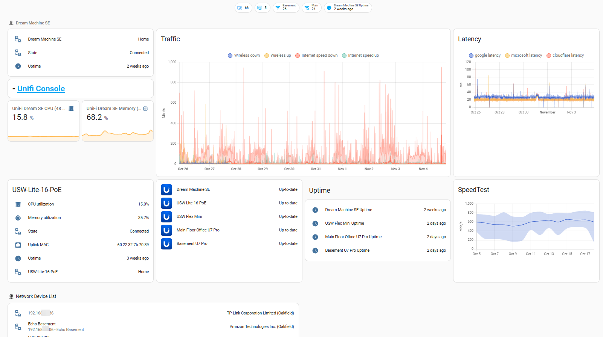
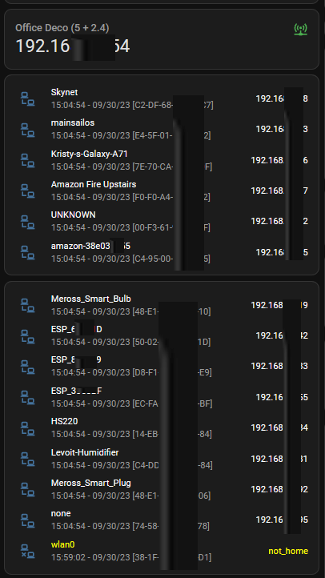

# MyHAConfig
A few different cards and dashboards from my HA configuration of interest to me.

There are issues that are logged due to the looping thru the different objects.  I have not finished troubleshooting thru that yet.

[`myUnifi.yaml`](myUnifi.yaml)

[`deco-connected-card.yaml`](deco-connected-card.yaml)

[`nmap-grid-card.yaml`](nmap-grid-card.yaml)

